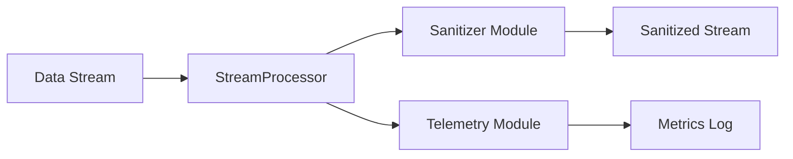

# core-stream-processor

[](https://github.com/aether-synth-dev/core-stream-processor/actions/workflows/ci.yml)

High-performance, zero-dependency utility for real-time data stream sanitization.

## Overview

Core Stream Processor is a production-ready Node.js module built on Clean Architecture principles. It provides enterprise-grade data sanitization with integrated performance telemetry, designed for high-throughput streaming applications without any external dependencies.

## Features

- **Zero Dependencies**: Built entirely on standard Node.js and JavaScript APIs
- **Security**: Advanced sanitization with XSS and SQL injection pattern detection, string length enforcement, and type validation
- **Telemetry**: Real-time performance metrics with millisecond-precision timing for all operations
- **Performance**: Lightweight, efficient processing with minimal overhead and optimized data pipelines

## System Architecture



## Installation

```bash
npm install core-stream-processor
```

## Usage

```javascript
const Processor = require('./index');

// Initialize processor
const processor = new Processor();

// Process data with automatic sanitization and telemetry
const result = processor.process('  Hello, World!  ', 'myOperation');

console.log(result.data);      // 'Hello, World!' (sanitized)
console.log(result.metrics);   // Array of performance metrics

// Retrieve all metrics
const allMetrics = processor.getMetrics();
```

## Testing

Run the comprehensive test suite:

```bash
node tests/test-suite.js
```

Run the demo application:

```bash
node examples/demo.js
```

## API Documentation

### `Processor`

Main orchestrator class coordinating telemetry and sanitization.

#### `constructor()`
Creates a new Processor instance.

#### `process(data, operationName)`
Processes data through sanitization pipeline with telemetry tracking.

- **Parameters:**
  - `data` - Data to process (string, number, boolean, object, array, null, undefined)
  - `operationName` - Operation identifier for telemetry
- **Returns:** Object with `data` (sanitized) and `metrics` (array)

#### `getMetrics()`
Retrieves all collected telemetry metrics.

- **Returns:** Array of metric objects with operationName, startTime, endTime, durationMs

## Architecture

The module follows Clean Architecture with clear separation of concerns:

- **Entry Point** (`index.js`) - Public API
- **Orchestration** (`lib/processor.js`) - Coordinates components
- **Domain Logic** (`lib/telemetry.js`, `lib/sanitizer.js`) - Core functionality

## Contributing

We welcome contributions! Please read our [Contributing Guidelines](CONTRIBUTING.md) before submitting pull requests.

## Code of Conduct

This project adheres to the [Code of Conduct](CODE_OF_CONDUCT.md). By participating, you are expected to uphold this code.

## License

This project is licensed under the MIT License - see the [LICENSE](LICENSE) file for details.

---

**Copyright © 2026 aether-synth-dev**
